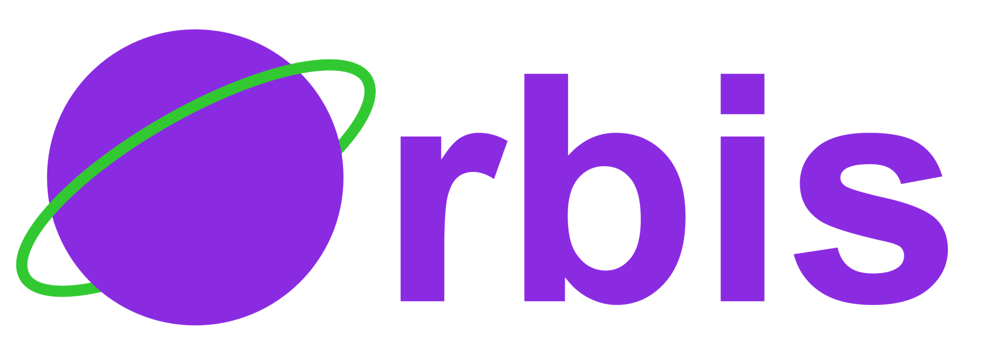

# Orbis

{width=50% height=auto}

Orbis is a comprehensive toolkit developed by the Astronomer RDC Team for customer success operations. It provides deployment reporting, resource analysis, and diagnostic capabilities for Astronomer Software deployments.

## Key Features

- **Report Generation**: Comprehensive deployment metrics analysis and resource utilization tracking
- **Diagnostic Scanner**: Curates comprehensive diagnostic packages - the critical deliverable for accelerating Astronomer support engagement
- **Custom Resource Support**: Custom resource allocation support
- **Multiple Output Formats**: DOCX reports, JSON data, and CSV exports
- **Docker-based Deployment**: Easy setup and consistent behavior across environments
- **Telescope Integration**: Advanced Airflow diagnostics

## Quick Start with Docker (Recommended)

### For Report Generation

1. Create a `.env` file with your configuration:
   ```env
   ASTRO_SOFTWARE_API_TOKEN=your_token_here
   ```
!!! warning

       Please use `SYSTEM_ADMIN` level token otherwise Orbis won't be able to query Prometheus and will result in empty metrics. [Ref](usage/software_reports.md#generate-system-admin-level-api-token)

2. Run Orbis using Docker:
   ```bash
   docker run --pull always --rm -it \
     --env-file .env \
     -v $(pwd)/output:/app/output \
     quay.io/astronomer/orbis:0.8.0 orbis compute-software \
     -s START_DATE \
     -e END_DATE \
     -b BASE_DOMAIN \
     [-v] [-w WORKSPACES] [-z] [-r] [-p]
   ```

### For Diagnostic Scanner

Create support bundle for troubleshooting:

```bash
docker run --pull always --rm -it \
  -v $(pwd)/output:/app/output \
  quay.io/astronomer/orbis:0.8.0 orbis scanner create \
  -n astronomer --image quay.io/astronomer/orbis-scanner:0.8.0
```

## Documentation Sections

- [Installation](installation.md)
- Usage
    - [Software Reports](usage/software_reports.md) - Report generation
    - [Software Diagnostics](usage/software_diagnostics.md) - Scanner support bundles
- Modules
    - API
        - [Houston](modules/api/houston.md)
        - [Prometheus](modules/api/prometheus.md)
    - Report
        - [Generator](modules/report/generator.md)
        - [Visualizer](modules/report/visualizer.md)
        - [CSV Generator](modules/report/csv_generator.md)
    - [Data Models](modules/data_models.md)
- [Reports](reports.md)

## Support

For support, please contact [success@astronomer.io](mailto:success@astronomer.io)
