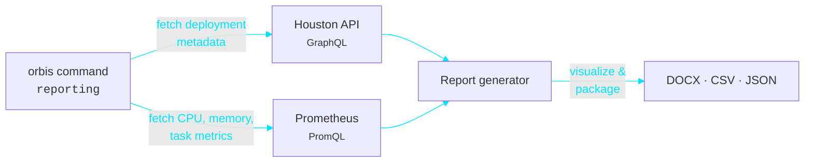
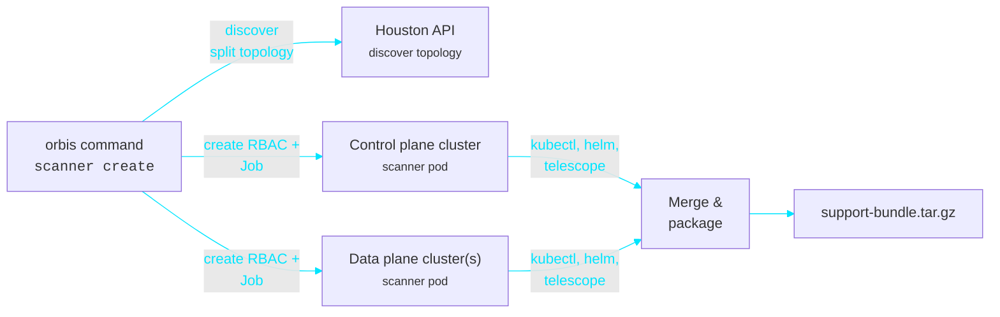

# Orbis

{width=50% height=auto}

Orbis is a diagnostic and reporting tool for Astronomer platforms. It collects support bundles from Kubernetes clusters and generates deployment compute reports.

Orbis collects metrics from Prometheus and deployment metadata from the Houston API to analyze Astro Private Cloud (APC) environments.

## Get started

- [Install Orbis](get-started/install.md)
- [Configure Orbis](get-started/configure.md)

## Generate reports

- [Generate a compute report](reporting/generate-report.md)
- [Manual Prometheus diagnostics](reporting/manual-prometheus-diagnostics.md)

## Collect diagnostics

- [Create a support bundle](scanner/create-support-bundle.md)
- [Collect from multi-cluster environments](scanner/multi-cluster-guide.md)
- [Resume and merge sessions](scanner/resume-sessions.md)

## How it works

### Reporting

### Scanner (support bundle)

The reporting flow queries the Houston API for deployment metadata and Prometheus for time-series metrics, then generates visualizations and packages results into DOCX, CSV, and JSON files.

The scanner flow discovers the APC cluster topology from Houston, creates scanner pods on the control plane and data plane clusters through Kubernetes jobs, collects diagnostic data using kubectl, Helm, and telescope, and merges everything into a single support bundle.


## Development

- [Set up local development](development/local-development-setup.md)
- [Contribute to orbis](development/contributing.md)
- [Build the documentation](development/building_docs.md)
- [Build the container image](development/docker-build.md)
- [Release process](development/release-process.md)


## Changelog

See the [changelog](changelog.md) for release history.
